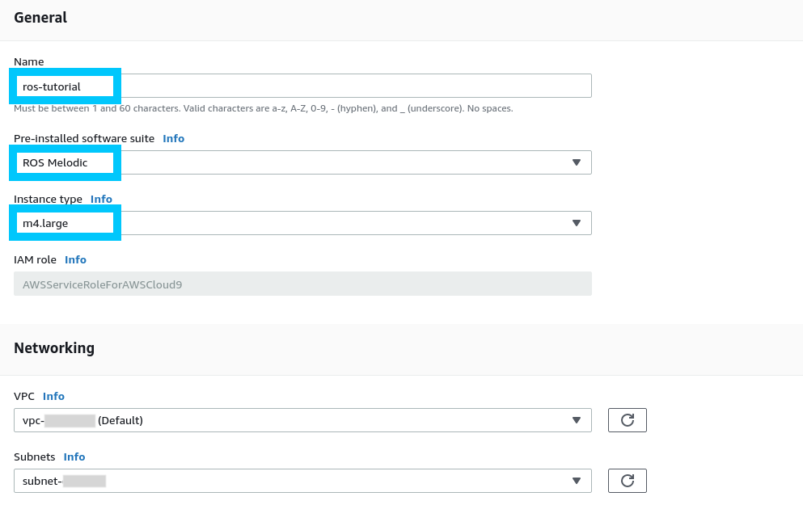
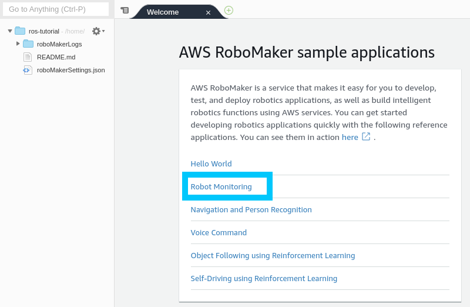
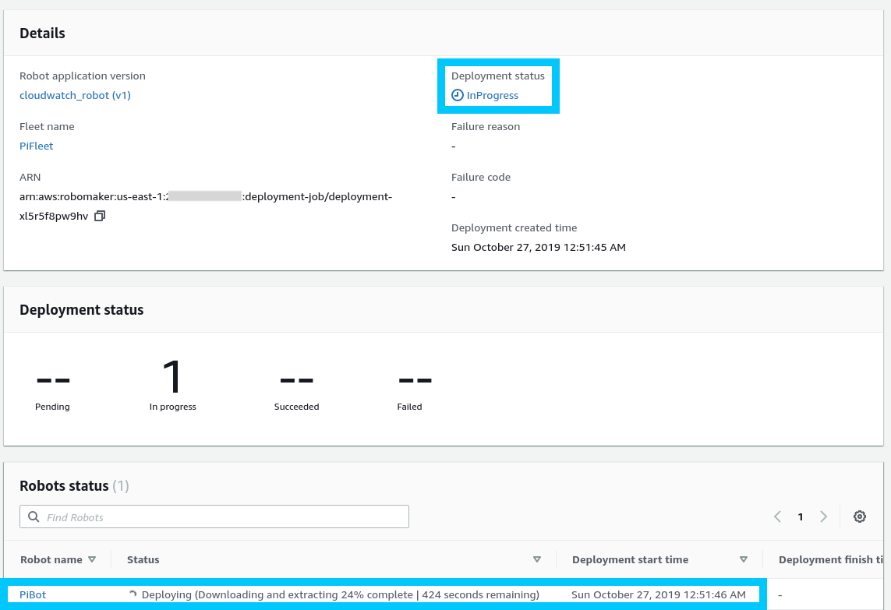
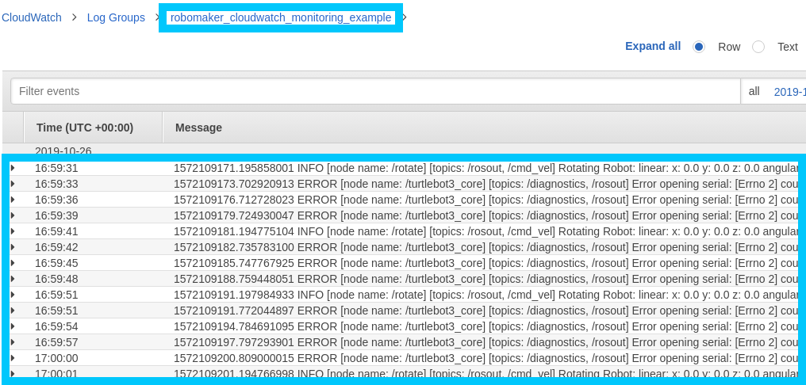

# AWS RoboMaker - Raspberry Pi Bootstrap

In the previous post [AWS IoT Greengrass CloudFormation – Raspberry Pi](https://devopstar.com/2019/10/07/aws-iot-greengrass-cloudformation-raspberry-pi/) we explored what is required to setup AWS Greengrass on a Raspberry Pi. This allowed us to manage a fleet of IoT edge devices using AWS CloudFormation.

With this in place we can begin to look at what we might be able to do with a Robot Fleet using another AWS service, AWS RoboMaker.

## Prerequisites

* AWS Account with [AWS CLI Setup](https://docs.aws.amazon.com/cli/latest/userguide/cli-chap-configure.html)
* Edge Device, in the case of this post I’m using a [Raspberry Pi 3B+](https://www.raspberrypi.org/products/raspberry-pi-3-model-b-plus/)
  * Have a Raspberry Pi setup with Greengrass already [based on the previous post](https://devopstar.com/2019/10/07/aws-iot-greengrass-cloudformation-raspberry-pi/)
* Clone [t04glovern/aws-robomaker-cfn](https://github.com/t04glovern/aws-robomaker-cfn) locally

## Quick Greengrass Setup

If you haven't already setup a device with Greengrass, I urge you to go do that before completing this post, however if you want a burst fire round on setting it up, I've included everything needed in this repository too.

**NOTE**: *I've stripped out some of the functionality that isn't required for RoboMaker from the `greengrass.yaml` we use below. Don't worry too much if you are still running it.*

**NOTE**: *I've also added some policy permissions that will need to be added to the existing Greengrass stack. You can simply run `update-stack` instead of `create-stack` with the following (presuming your stack is named the same).

```bash
aws cloudformation create-stack \
    --stack-name "devopstar-rpi-gg-core" \
    --template-body file://aws/greengrass.yaml \
    --region "us-east-1" \
    --capabilities CAPABILITY_IAM
```

Copy the certificates and config out and over to your Greengrass device.

```bash
cd aws
./greengrass.sh
```

Using the appropriate Greengrass version from [here](https://docs.aws.amazon.com/greengrass/latest/developerguide/what-is-gg.html#gg-core-download-tab) install and setup Greengrass (referring to the previous guide when needed).

## RoboMaker Create

The first step will be to create a brand new robot through RoboMaker. This process requires four parts:

* RoboMaker Fleet Create
* RoboMaker Robot Create
* RoboMaker Application Create
* RobotMaker Deployment Create

Luckily we're able to use CloudFormation for a good portion of this deployment currently.

```bash
cd aws
./robomaker.sh
```

Then the deployment completes you'll be presented with a bucket that we will use in the next step to store our RoboMaker app

```bash
# Put robot deployment files in s3://BUCKET_NAME
```

## Cloud9 Environment

To make life easier when working with ROS we will be making use of ROS Cloud9 Environments. This is effectively a cloud IDE with everything ROS setup for you.

Navigate to the developer [IDE section in AWS RoboMaker](https://console.aws.amazon.com/robomaker/home?region=us-east-1#ides) and create a new instance with the following settings.



Once the environment starts up we're just going to open an example project by clicking "Robot Monitoring". You will begin to see a download occuring pulling down the sample project; and once complete you will be presented with a `README`.



```bash
sudo apt-get update
rosdep update
```

### Build & Bundle

#### x86_64

Building and bundling for x86_64 is really easy since we're already on an x86_64 system architecture.

```bash
cd ~/environment/CloudWatch/robot_ws
rosws update
rosdep install --from-paths src --ignore-src -r -y
colcon build
```

We will use Colcon to build and bundle our robot application

```bash
cd ~/environment/CloudWatch/robot_ws
source install/local_setup.sh
colcon bundle
```

#### armhf

Since we're trying to build for the Raspberry Pi we need to make sure we're cross compiling for `armhf`. Start off by building the cross-compile docker image (this step will take a while)

```bash
cd /opt/robomaker/cross-compilation-dockerfile/
sudo bin/build_image.bash
```

Connect to the `ros-cross-compile` container

```bash
cd ~/environment/CloudWatch/robot_ws
sudo docker run -v $(pwd):/ws -it ros-cross-compile:armhf
```

Now you're inside the cross-compilation docker container. Run the following commands to build the workspace

```bash
# build the workspace
cd ws
apt update
rosdep install --from-paths src --ignore-src -r -y

# These steps will take a while
colcon build --build-base armhf_build --install-base armhf_install
colcon bundle --build-base armhf_build --install-base armhf_install --bundle-base armhf_bundle --apt-sources-list /opt/cross/apt-sources.yaml
```


Finally, exit the container after the bundle is successful

```bash
exit
```

### Copy Bundle to S3

Copy the bundle to our S3 bucket using the following command

```bash
aws s3 cp armhf_bundle/output.tar s3://BUCKET_NAME/cloudwatch_robot/output.tar
```

## RoboMaker App Deploy

```bash
cd aws
./robomaker-app.sh
```

The status of the deployment can be viewed in the RoboMaker deployment console



Once the deployment is successful you should start to see CloudWatch logs coming through (in us-west-2 by default)



## Cleanup

Before walking away from the project, make sure to remove the things we setup (esspecially the Cloud9 Environment). This can be done from the [RoboMaker Environments section of the portal](https://console.aws.amazon.com/robomaker/home?region=us-east-1#ides)


