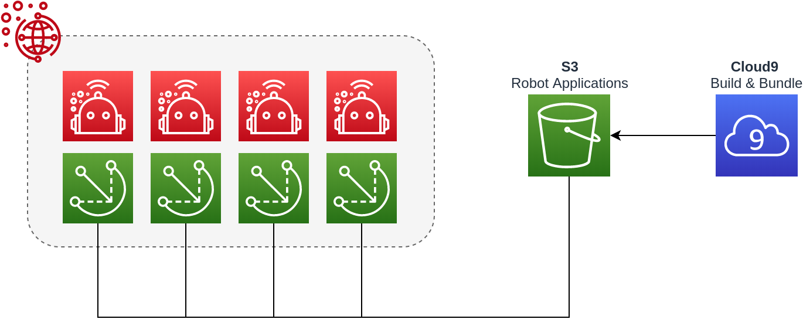

# AWS RoboMaker - CloudFormation

In this guide we'll be looking at how to build and bundle ROS applications specifically for the Raspberry Pi ARMHF architecture using Cloud9.

The final goal is to have the bundled application deployed over AWS RoboMaker.

## Architecture

## Attribution

* [Deploy Robot Application - Cross Compile Cloud9](https://docs.aws.amazon.com/robomaker/latest/dg/gs-deploy.html)